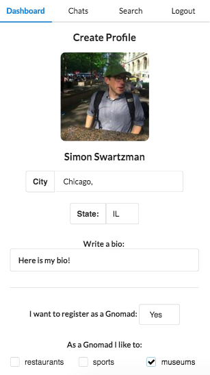
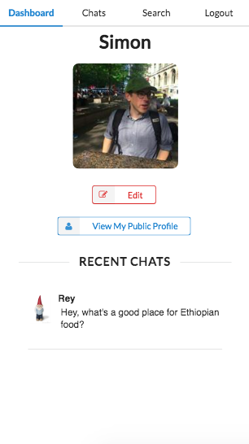
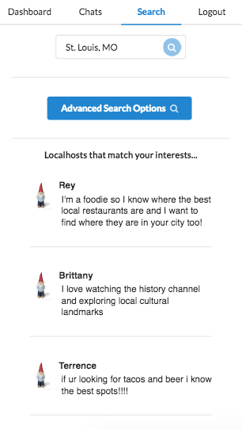
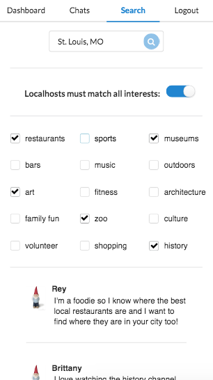
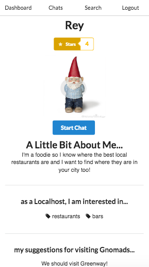
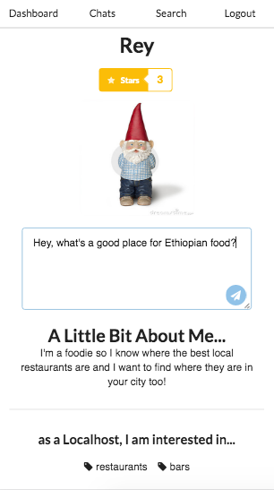
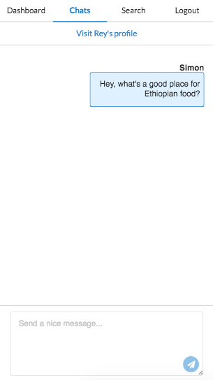
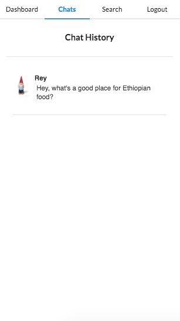

# GNOMAD

Completed in 7 days as a capstone project for Dev Bootcamp, this mobile-first single-page web app allows travellers, or "gnomads," to connect with city residents, or "localhosts," in order to have an authentic local experience of their travel destination.

Uses a Ruby on Rails API backend, React front-end, Facebook OAuth for third-party authentication, ActionCable for real-time chats, and Semantic UI for a clean, responsive design.

## TEAM
* Stacy Curry (@stacurry)
* Joe LeBeau (@joelebeau1)
* Tové Mercer (@tovemercer)
* K. Sabbak (@ksabbak)
* Simon Swartzman (@rtzm)

## Create a new profile

## View your dashboard

## Search for a localhost

## Use advanced search filters

## View another user's profile

## Start a new chat

## View a single, real-time chat

## View your chat history

